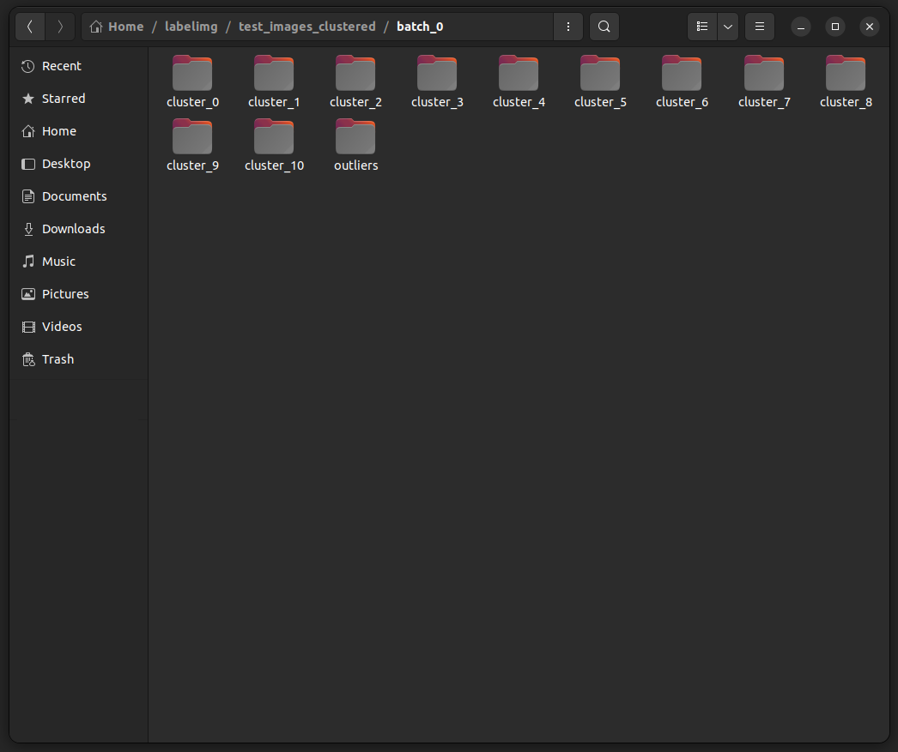
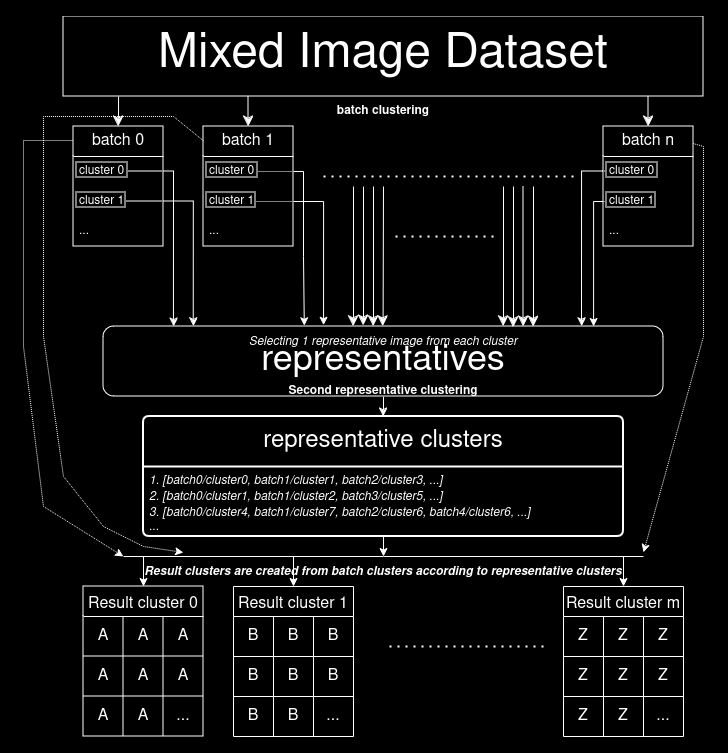

# Image Clustering and Segmenting: icas
Tool for labeling images

<br/><br/>
<br/><br/>

# clusterimg
Tool for clustering mixed images. Further details about classes can be found [here](clusterimg/README.md). Main image clustering pipeline flow operates as follows:  

Process starts with folder full of mixed images:  
  

#### 1- For each batch:  
* image features are obtained with one of these five methods:
  * SSIM: images itself is used as feature
  * minhash: vector of most obvious corners pixel locations are used as feature. Corners are detected with [cornerHarris from opencv](https://docs.opencv.org/4.x/dd/d1a/group__imgproc__feature.html#gac1fc3598018010880e370e2f709b4345)
  * imagehash: perceptual hash of image is used as feature, phash is calculated with [ImageHash library](https://pypi.org/project/ImageHash/)
  * ORB: images ORB features are used as feature. features are calculated with [ORB class from opencv](https://docs.opencv.org/4.x/db/d95/classcv_1_1ORB.html)
  * TM: images itself is used as feature
* similarities are calculated with selected methods similarity calculation:  
  * SSIM: [structural_similarity from scikit-image](https://scikit-image.org/docs/stable/api/skimage.metrics.html#skimage.metrics.structural_similarity) is used
  * minhash: [jaccard from datasketch](http://ekzhu.com/datasketch/minhash.html) is used
  * imagehash: difference between two hash values are used.
  * ORB: ratio of good matches over all matches are used
  * TM: minimum error at [template matching from opencv](https://docs.opencv.org/4.x/df/dfb/group__imgproc__object.html#ga586ebfb0a7fb604b35a23d85391329be) is used

  Two image with similarity score bigger than threshold is considered similar, threshold can be given as parameter or interactively selected from set of computations over small data sample. Y axis is threshold value and X axis is the number of expected similar pairs at corresponding threshold value. Approximate number of clustered image is calculated and displayed when a threshold value is hovered:  
    
  (Interactive selection can be problematic on notebooks or different backend GUIs)
* similar images are clustered with "If and X and Y image are similar, they are putted into same cluster. If any X and Y image has an image chain X-A-B-...-N-Y that has consecutive pair similarities, they are putted into same cluster." logic
* all clusters + outliers are writed into batch's folder  

A folder full of batch folders and computed image similarities are created after first step:  

Sample batch folder content(each cluster folder has similar found images inside it):  


#### 2- Merging batch folders  
* first image from all cluster folders at every batch folder is selected as a "representative" for that cluster  
* representative features are obtained
* similarities between these representatives are calculated
* similar representatives are clustered
* cluster folders are merged according to their representatives belonging cluster

All batch folders are merged in one resutl folder after second step:  

Sample cluster folder content:  


### Deep Learning supported image clustering pipeline flow operates as follows:  

#### 1- For whole dataset:  
* If there ins't already a trained model deep learning model is trained with one of the following loss functions:  
  * [PyTorch MSELoss](https://pytorch.org/docs/stable/generated/torch.nn.MSELoss.html)  
  * [PyTorch L1Loss](https://pytorch.org/docs/stable/generated/torch.nn.L1Loss.html)  
  * perceptual loss, which is obtained by passing both the deep learning models input and output to another feature extractor model(default is [torchvision VGG19](https://pytorch.org/vision/main/models/generated/torchvision.models.vgg19.html)). Then calculating the mean of features difference.

#### 2- For each batch:  
* image features are obtained from deep learning model
* selected clustering model are created according to given parameters:
  * [Kmeans from scikit-learn](https://scikit-learn.org/stable/modules/generated/sklearn.cluster.KMeans.html)
  * [Agglomerative Clustering from scikit-learn](https://scikit-learn.org/stable/modules/generated/sklearn.cluster.AgglomerativeClustering.html), which is hierarchy
  * [DBSCAN from scikit-learn](https://scikit-learn.org/stable/modules/generated/sklearn.cluster.DBSCAN.html)
  * [Gaussian Mixture from scikit-learn](https://scikit-learn.org/stable/modules/generated/sklearn.mixture.GaussianMixture.html)
  * [HDBSCAN from scikit-learn](https://scikit-learn.org/stable/modules/generated/sklearn.cluster.HDBSCAN.html)
* all models are evaluated after clustering image features and best model is selected according to three metrics(maximizing the silhouette and calinski_harabasz scores, minimizing the davies_bouldin score):
  * [silhouette_score from scikit-learn](https://scikit-learn.org/stable/modules/generated/sklearn.metrics.silhouette_score.html)
  * [davies_bouldin_score from scikit-learn]
(https://scikit-learn.org/stable/modules/generated/sklearn.metrics.davies_bouldin_score.html)
  * [calinski_harabasz_score from scikit-learn](https://scikit-learn.org/stable/modules/generated/sklearn.metrics.calinski_harabasz_score.html)
* best model is used to cluster the images
* all clusters + outliers(there wont be any outlier but outlier folder is kept to match the format of main pipeline) are writed into batch's folder  

#### 3- Merging batch folders  
* first image from all cluster folder at every batch folder is selected as a "representative" for that cluster  
* representative features are obtained
* selected clustering model are created according to given parameters
* all models are evaluated and best model is selected
* representatives clustered with best model
* cluster folders are merged according to their representatives belonging cluster

In deep learning pipeline, main flow is preserved. Only the underlying structure for computations such as image feature extraction(done by feature extractor deep learning models) and similarity calculation(done by clustering models) are changed.  

Main Flow(hard cornered item means a folder in computer, soft cornered item means a variable held storage during run time):  


### Computation workload and efficiency for main flow

$C$: number of classes  
$O$: number of outliers  
$S$: number of similar items  

We can separate all calculations into two type of calculations, intra and inter class calculations. For each individual class, we can think it as two graphs: $SG$(similars_graph) containing similar items and $OG$(outliers_graphs) containing outlier items.

<pre>
<code>
<span style="color:purple;">for each batch:</span>
    <span style="color:purple;">for ith class in batch:</span>
        <span style="color:green;"># c_i is set of items in ith class</span>
        <span style="color:green;"># p_i is the probability of an item being in SG</span>
        <span style="color:lightgray;">S_i = |c_i| * p_i # number of similar items</span>
        <span style="color:lightgray;">O_i = |c_i| * p_i # number of outlier items</span>
        <span style="color:lightgray;">L_i = Comb(S_i-1, 2) # number of links between similar items</span>
</code>
</pre>

#### intra-class
Number of needed intra-class calculations for each class can be computed like this:  
* To cover links inside $SG$: $((S_{i})-1)$ calculations  
* To cover links inside $OG$: $\binom{O_i}{2}$ calculations  
* Links between $SG$ and $OG$: $(O_{i})$ calculations(will be covered in inter-class calculations)  

So for each class $c_{i}$ in batch, total of:  
$((S_{i})-1) + \frac{O_i(O_i - 1)}{2}$ calculations are enough to create $SG$ and $OG$ graphs

#### inter-class
Now each $SG$ and $OG$ graph in same batch must also be compared between themself. For each class pair $(c_{i}, c_{j}$) number of needed inter-class calculations can be computed like this:  
* $((SG_{i}), (SG_{j}))$: $1$ calculation  
* $((OG_{i}), (OG_{j}))$: $\binom{O_i+O_j}{2}$ calculation  
* $((SG_{i}), (OG_{j}))$: $(O_{j})$ calculation  
* $((OG_{i}), (SG_{j}))$: $(O_{i})$ calculation  

Inter-class calculations are calculated only once, so above four steps can be generalized to all classes as follows:  
* to cover all $(SG, SG)$ graph pairs: $\frac{C(C - 1)}{2}$ calculation  
* to cover all $(OG, OG)$ graph pairs: $\frac{O(O - 1)}{2}$ calculation  
* to cover all $(SG, OG)$ graph pairs: $O*C$ calculation  

#### batch
So for a batch, total of:  
$\frac{C(C - 1)}{2} + \frac{O(O - 1)}{2} + O*C$ calculations

#### representatives
After doing all batch calculations we will end up with batch folders containing cluster and outlier folders. One item from every cluster folder is selected to handle the second phase with representative items. Representative items can be thinked as a class and needed computations can be calculated as:  
$(S_{r}-1) + \frac{O_r(O_r - 1)}{2} + O_{r}$

Now if we combine all combinations in one equations, here is the total similarity computation workload of one full main clustering pipeline:


for batch in dataset:  
&emsp;&emsp;for ith class in batch:  
&emsp;&emsp;&emsp;&emsp;$`(S_{i}-1) + \frac{O_i(O_i - 1)}{2}`$  
&emsp;&emsp;$`\frac{C(C - 1)}{2} + \frac{O(O - 1)}{2} + O*C`$  
$`(S_{r}-1) + \frac{O_r(O_r - 1)}{2} + O_{r}`$  


To write the equations using known variables:  
* $B$: number of batches  
* $C$: number of classes in the dataset  
* $p_{i}$: expected probability of class item similarity  
* $P$: vector of expected similar items in each class: $`[(|c_{1}|*p_{1}), (|c_{2}|*p_{2}), (|c_{3}|*p_{3})...]`$  
* $T$: vector of expected outlier items in each class: $`[(|c_{1}|-P_{1}), (|c_{2}|-P_{2}), (|c_{3}|-P_{3})...]`$  
* $R$: expected number of representatives are $B*C$ when all classes are distributed equally to batches. Expected number of similars in representatives are $C$, outliers are $(B-1)*C$

for batch in dataset:  
&emsp;&emsp;for ith class in batch:  
&emsp;&emsp;&emsp;&emsp;$`(P_{i}-1) + \frac{T_i(T_i - 1)}{2}`$ <font size="2">--> calculates each classes' SG and OG</font>  
&emsp;&emsp;$`\frac{C(C - 1)}{2} + \frac{(\sum{T})((\sum{T}) - 1)}{2} + (\sum{T})*C`$ <font size="2">--> merges SGs with OGs</font>  
$`(C-1) + \frac{((B-1)*C)(((B-1)*C) - 1)}{2} + ((B-1)*C)`$ <font size="2">--> merges representatives</font>  

Now since we all know the variables, we can compute the expected number of computations and how much more efficient is clustering than pairwise checking for a dataset by running below code with selected parameters(Keep in mind that below code generates the worst-case scenario for clustering and calculates approximate expected calculations. Clustering algorithm will be more efficient than these calculations with parallel threads and some additional optimizations.):  
<pre>
<code>
<span style="color:purple;">import random</span>

<span style="color:lightgray;">N = 20000 <span style="color:green;"> # number of items in dataset</span></span>
<span style="color:lightgray;">C = 5 <span style="color:green;"> # number of classes</span></span>
<span style="color:lightgray;">b = 2500 <span style="color:green;"> # batch size</span></span>
<span style="color:lightgray;">B = N // b <span style="color:green;"> # number of batches</span></span>
<span style="color:lightgray;">c = [f"c_{i}" for i in range(C)]</span> <span style="color:green;"> # expexted class labels</span>
<span style="color:lightgray;">p = [0.5, 0.5, 0.5, 0.5, 0.5]</span> <span style="color:green;"> # expected similarity rating for classes</span>
<span style="color:lightgray;">classes_and_ps = dict(map(lambda i,j : (i,j) , c,p))</span>

<span style="color:lightgray;">dataset = [(str(i),random.choice(c)) for i in range(N)]</span>

<span style="color:lightgray;">class_SG_OGs = []</span> <span style="color:green;"> # list to log number of computations for every class in each batch</span>
<span style="color:lightgray;">merge_SG_OGs = []</span> <span style="color:green;"> # list to log number of computations end of every batch</span>

<span style="color:purple;">for i in range(0,N, b):</span>
    <span style="color:lightgray;">batch = dataset[i:i+b]</span>
    <span style="color:lightgray;">Ps, Ts = [], []</span>
    <span style="color:purple;">for c_id in c:</span>
        <span style="color:lightgray;">class_items = [i for i in batch if i[1] == c_id]</span>
        
        <span style="color:lightgray;">P_i = len(class_items) * classes_and_ps[c_id]</span>
        <span style="color:lightgray;">T_i = len(class_items) - P_i</span>

        <span style="color:lightgray;">Ps.append(P_i)</span>
        <span style="color:lightgray;">Ts.append(T_i)</span>

        <span style="color:lightgray;">class_SG_OG = int((P_i-1) + (T_i)*(T_i-1)/2)</span>
    <span style="color:lightgray;">class_SG_OGs.append(class_SG_OG)</span>

    <span style="color:lightgray;">merge_SG_OG = (C*(C-1))/2 + sum(Ts)*(sum(Ts)-1)/2 + sum(Ts)*C</span>
    <span style="color:lightgray;">merge_SG_OGs.append(merge_SG_OG)</span>

<span style="color:lightgray;">merge_representatives = (C-1) + (((B-1)*C)*((B-1)*C-1))/2 + ((B-1)*C)</span>

<span style="color:lightgray;">total_pairs = N*(N-1)/2</span>
<span style="color:lightgray;">expected_calculations = sum([sum(merge_SG_OGs), sum(merge_SG_OGs), merge_representatives])</span>

<span style="color:lightgray;">print(f"Saved {100 - expected_calculations / total_pairs * 100} of all computations.")</span>
</code>
</pre>

### Further possible optimizations:  
* openmp optimizations
* C/C++ optimizations
* CUDA optimizations

<br/><br/>
<br/><br/>

# segmentimg 
Tool for interactively segmentating images. Further details about classes can be found [here](segmentimg/README.md). Main image segmenting pipeline flow operates as follows:  

### 1- image is divided into segments with one of these methods. Segmented image will have labeled segments starting from 1(also edges with value of 0 if any):
* edge: image is divided with edges using opencv's operations
* superpixel: [opencv's superpixel](https://docs.opencv.org/4.x/df/d6c/group__ximgproc__superpixel.html#ga503d462461962668b3bffbf2d7b72038) is used
* kmeans: [opencv's kmeans](https://docs.opencv.org/4.x/d5/d38/group__core__cluster.html#ga9a34dc06c6ec9460e90860f15bcd2f88) is used
* slickmeans: first opencv's superpixel, than opencv's kmeans is applied
* chanvase: [scikit-image's chan vese](https://scikit-image.org/docs/stable/api/skimage.segmentation.html#skimage.segmentation.chan_vese) is used
* felzenszwalb: [scikit-image's felzenszwalb](https://scikit-image.org/docs/stable/api/skimage.segmentation.html#skimage.segmentation.felzenszwalb) is used
* quickshift: [scikit-image's quickshift](https://scikit-image.org/docs/stable/api/skimage.segmentation.html#skimage.segmentation.quickshift) is used
* graph: [opencv's graph segmentation](https://docs.opencv.org/4.x/dd/d19/classcv_1_1ximgproc_1_1segmentation_1_1GraphSegmentation.html) is used
* grabcut: [opencv's grabcut](https://docs.opencv.org/4.x/d3/d47/group__imgproc__segmentation.html#ga909c1dda50efcbeaa3ce126be862b37f) is used. Segmentation is done manually on two window with five annotation types:  
  * Segments window: displays the current segments of image  
  * Annotations window: displays the current annotations on image  
  * rectangle annotation: annotated with mouse middle button, indicates the attention area of the grabcut  
  * foreground and background annotation: annotated with left and right click, indicates the pixels that are definitely foreground or background  
  * possible foreground and background annotation: annotated with ctrl + left and right click, indicates the pixels that may be foreground or background  
    
    Also keyboard inputs are listened for various actions other than painting:  
  * q: quits the segmentation  
  * f: finishes the image segmentation and passes image to interactive painting  
  * r: resets the annotations  
  * space: runs grabcut once(multiple presses are needed for convergence)  
  Annotations of a sample grabcut:  
    
  selected foreground:  
    

* SAM: [Meta's Segment Anything Model](https://github.com/facebookresearch/segment-anything) is used. Segmentation is done by one of two SAM models: SamAutomaticMaskGenerator(doesnt require any annotation, all processes are automatic) or SamPredictor(prompt must be generated on a window with three annotation types):  
  * Annotations window: displays the current segments of image  
  * rectangle annotation: annotated with mouse middle button, indicates the attention area  
  * foreground and background annotation: annotated with left and right click, indicates the pixels that are definitely foreground or background  

    Also keyboard inputs are listened for various actions other than painting:  
  * q: quits the segmentation  
  * r: resets the annotations  
  * space: ends segmenting and passes prompt to prediction function  
  * f: finishes the segmentation and passes image to interactive painting  
  * z: reverses the last annotation  
    Annotations of a sample SAM:  
      
    generated mask:  
      

### 2- Two window is showed to user, one for color selecting other for painting segments.  
* Color selecting window is used for selecting the segmentation color and displaying the painting mode. There are two paint modes other than default clicking actions. One is for continuously filling and other is unfilling. Both of them are activated and deactivated with double click on related mouse button.  
  Sample image "jet1.jpg":  
   
  Segments for "jet1.jpg" using superpixel(selected method and its parameters should be selected for better segments, this is only for explanatory purposes[black lines around red painted area are edge annotations, originally not included in segments]):  
    
  Painted image:  
    
  Generated Mask "jet1_mask_(R:204,G:0,B:0).png":  
  .png)  

* Painting are done in segmenting window. Left click fills the segment and right click unfills, Rapid filling and unfilling can be done with continuous modes. Middle button is used to make a cut, a line is cutted between consecutive middle button clicked points and cutted pixels are assigned to be an edge. Also keyboard inputs are listened for various actions other than painting:  
  * q: quits the segmentation  
  * n: goes to next image in folder(no save)  
  * p: goes to previous image in folder(no save)  
  * space: saves the current image masks with "original_image_name\_mask\_(R:value,G:value,B:value).png" format and goes to next image  
  * z: reverses the last action  
  * r: resets the segmentation  
  * d: displays the image segmentation and painted pixels for debug purposes  
  * t: applies template painting. Painting is done with four base image type template, attention(optional), segment and mask(optional). Attention and mask images can generated from template and segment images if not provided.  
    * template: template to look for a match in image  
    * attention: masks that indicates which parts of the templates are considered while looking for a match  
    * segment: paint to put over found match  
    * mask: indicates which pixels on the segment image will painted on the image  
      Sample template(means we will search for a plane in this pose):  
        
      Sample attention(means that we will ignore the sky and only focus on plane similarity):  
        
      Sample segment(means these pixels will be painted):  
        
      Sample mask(means only white pixels will be painted):  
        

<br/><br/>
<br/><br/>

# To user attention:
Below libraries are not installed with icas since aim for __icas__ is to be lightweight. Advanced usage such as Deep Learning Clustering and SAM segmentation requires below installations:
```python
pip install torch
pip install torchvision
pip install scikit-learn
pip install git+https://github.com/facebookresearch/segment-anything.git
```