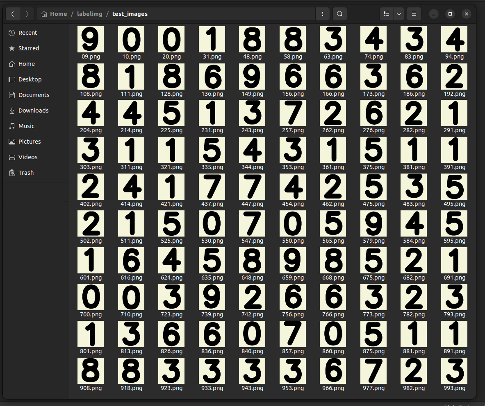
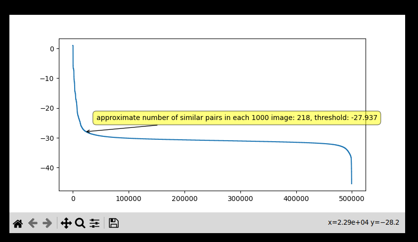
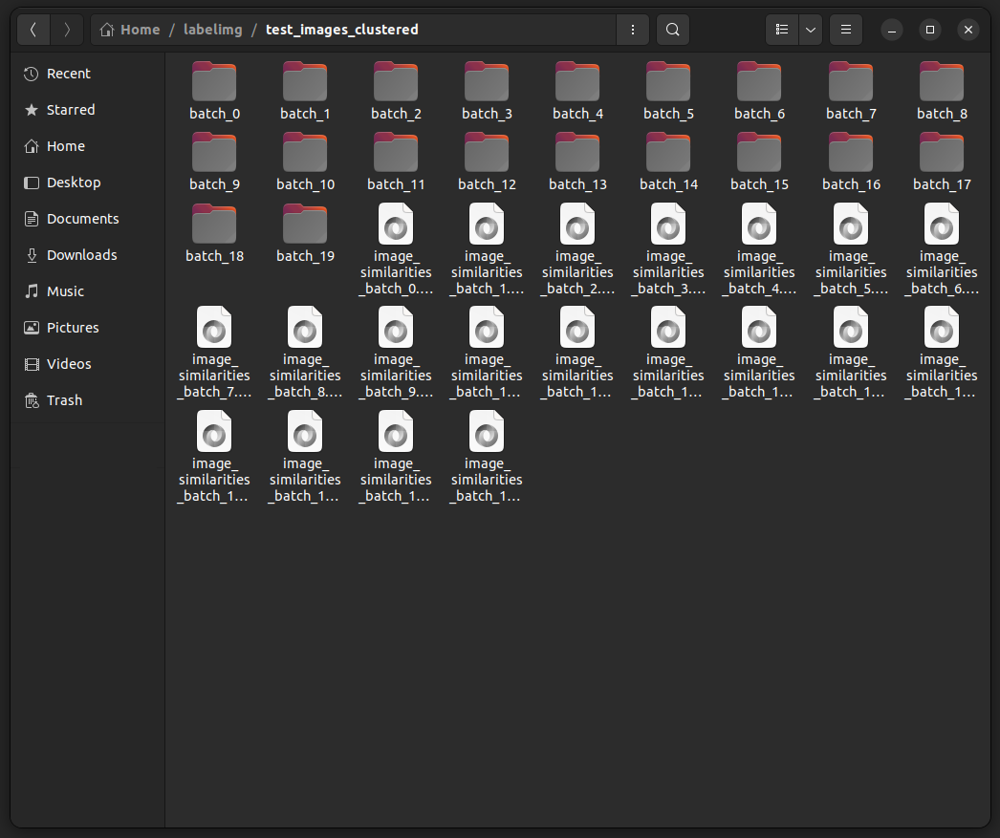
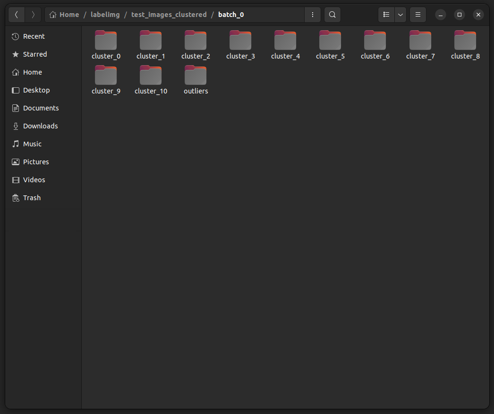
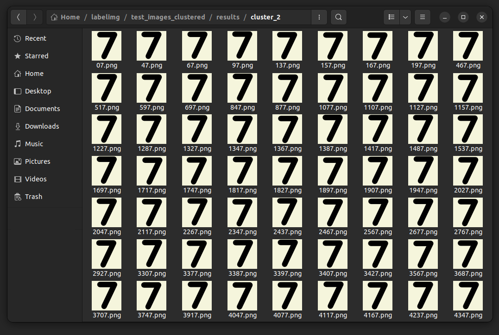
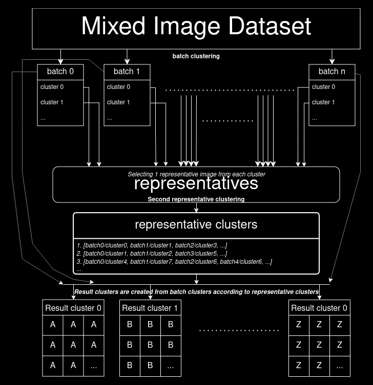

# Clusterimg
Tool for clustering mixed images.

## Main image clustering pipeline flow operates as follows:  

Process starts with folder full of mixed images:  
  

### 1- For each batch:  
* image features are obtained with one of these five methods:
  * SSIM: images itself is used as feature
  * minhash: vector of most obvious corners pixel locations are used as feature. Corners are detected with [cornerHarris from opencv](https://docs.opencv.org/4.x/dd/d1a/group__imgproc__feature.html#gac1fc3598018010880e370e2f709b4345)
  * imagehash: perceptual hash of image is used as feature, phash is calculated with [ImageHash library](https://pypi.org/project/ImageHash/)
  * ORB: images ORB features are used as feature. features are calculated with [ORB class from opencv](https://docs.opencv.org/4.x/db/d95/classcv_1_1ORB.html)
  * TM: images itself is used as feature
* similarities intra-batch are calculated with selected methods similarity calculation:  
  * SSIM: [structural_similarity from scikit-image](https://scikit-image.org/docs/stable/api/skimage.metrics.html#skimage.metrics.structural_similarity) is used
  * minhash: [jaccard from datasketch](http://ekzhu.com/datasketch/minhash.html) is used
  * imagehash: difference between 2 hash values are used.
  * ORB: ratio of good matches over all matches are used
  * TM: minimum matching error is used

  Two image with similarity score bigger than threshold is considered similar, threshold can be given as parameter or interactively selected from set of computations over small data sample. Y axis is threshold value and X axis is the number of expected similar pairs at corresponding threshold value. Approximate number of clustered image is calculated and displayed when a threshold value is hovered:    
  
* similar images are clustered with "If and X and Y image are similar, they are putted into same cluster. If any X and Y image has an image chain X-A-B-...-N-Y that has consecutive pair similarities, they are putted into same cluster." logic
* all clusters + outliers are writed into batch's folder  

A folder full of batch folders and computed image similarities are created after first step:  

Sample batch folder content(each cluster folder has similar found images inside it):  

### 2- Merging batch folders  
* first image from all cluster folders at every batch folder is selected as a "representative" for that cluster  
* representative features are obtained
* similarities between these representatives are calculated
* similar representatives are clustered
* cluster folders are merged according to their representatives belonging cluster

All batch folders are merged in one resutl folder after second step:  

Sample cluster folder content:  

## Deep Learning supported image clustering pipeline flow operates as follows:  

### 1- For whole dataset:  
* If there ins't already a trained model Autoencoder model is trained with one of the following loss functions:  
  * [PyTorch MSELoss](https://pytorch.org/docs/stable/generated/torch.nn.MSELoss.html)  
  * [PyTorch L1Loss](https://pytorch.org/docs/stable/generated/torch.nn.L1Loss.html)  
  * perceptual loss, which is obtained by passing both the autoencoder models input and output to another feature extractor model(default is [torchvision VGG19](https://pytorch.org/vision/main/models/generated/torchvision.models.vgg19.html)). Then calculating the mean of features difference.

### 2- For each batch:  
* image features(latent representations at the middle of the autoencoder) are obtained
* selected clustering model are created according to given parameters:
  * [Kmeans from scikit-learn](https://scikit-learn.org/stable/modules/generated/sklearn.cluster.KMeans.html)
  * [Agglomerative Clustering from scikit-learn](https://scikit-learn.org/stable/modules/generated/sklearn.cluster.AgglomerativeClustering.html), which is hierarchy
  * [DBSCAN from scikit-learn](https://scikit-learn.org/stable/modules/generated/sklearn.cluster.DBSCAN.html)
  * [Gaussian Mixture from scikit-learn](https://scikit-learn.org/stable/modules/generated/sklearn.mixture.GaussianMixture.html)
  * [HDBSCAN from scikit-learn](https://scikit-learn.org/stable/modules/generated/sklearn.cluster.HDBSCAN.html)
* all models are evaluated and best model is selected according to three metrics(maximizing the silhouette and calinski_harabasz scores, minimizing the davies_bouldin score):
  * [silhouette_score from scikit-learn](https://scikit-learn.org/stable/modules/generated/sklearn.metrics.silhouette_score.html)
  * [davies_bouldin_score from scikit-learn](https://scikit-learn.org/stable/modules/generated/sklearn.metrics.davies_bouldin_score.html)
  * [calinski_harabasz_score from scikit-learn](https://scikit-learn.org/stable/modules/generated/sklearn.metrics.calinski_harabasz_score.html)
* best model is used to cluster the images
* all clusters + outliers(there wont be any outlier but outlier folder is kept to match the format of main pipeline) are writed into batch's folder  

### 3- Merging batch folders  
* first image from all cluster folder at every batch folder is selected as a "representative" for that cluster  
* representative features are obtained
* selected clustering model are created according to given parameters
* all models are evaluated and best model is selected
* representatives clustered with best model
* cluster folders are merged according to their representatives belonging cluster

In deep learning pipeline, main flow is preserved. Only the underlying structure for calculations are changed.  

Main Flow(hard cornered item means a folder in computer, soft cornered item means a variable held storage during run time):  

## Further possible optimizations:  
* openmp optimizations
* C/C++ optimizations
* CUDA optimizations
