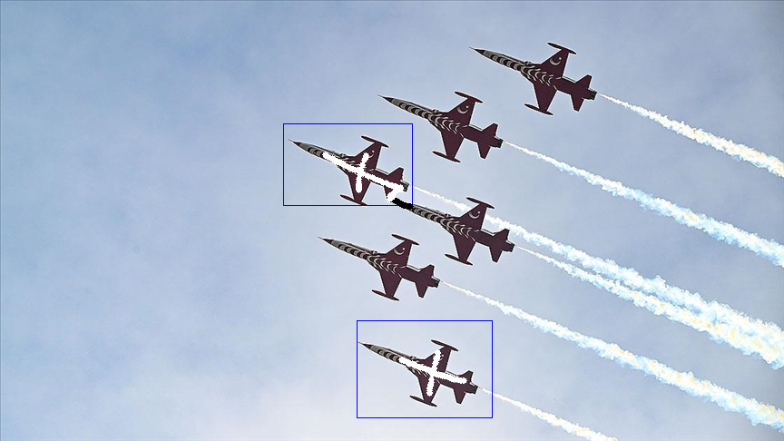
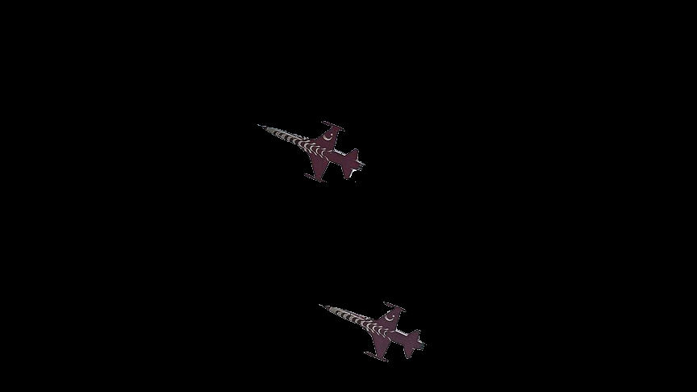
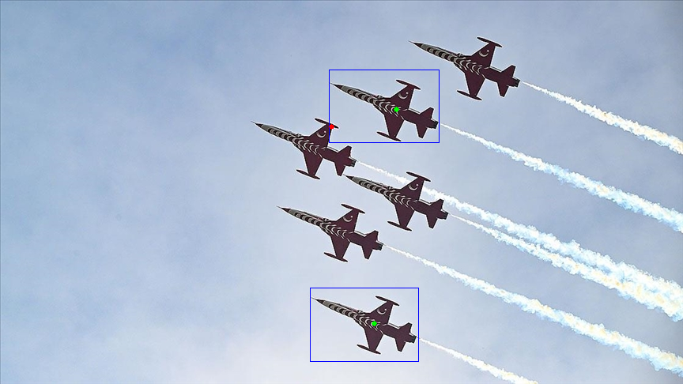
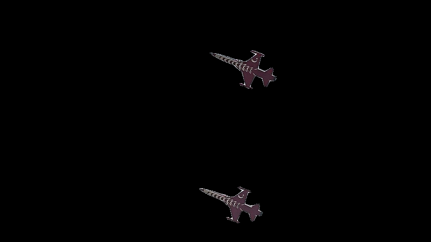
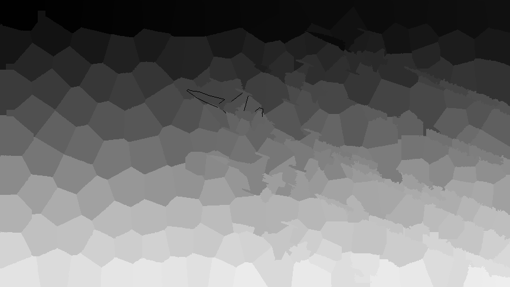
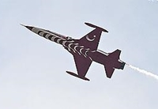

# Segmentatimg 
Tool for interactively segmentating images. Main image segmenting pipeline flow operates as follows:  

## 1- image is divided into segments with one of these methods. Segmented image will have labeled segments starting from 1(also edges with value of 0 if any):
* edge: image is divided with edges using opencv's operations
* superpixel: [opencv's superpixel](https://docs.opencv.org/4.x/df/d6c/group__ximgproc__superpixel.html#ga503d462461962668b3bffbf2d7b72038) is used
* kmeans: [opencv's kmeans](https://docs.opencv.org/4.x/d5/d38/group__core__cluster.html#ga9a34dc06c6ec9460e90860f15bcd2f88) is used
* slickmeans: first opencv's superpixel, than opencv's kmeans is applied
* chanvase: [skimage's chan vese](https://scikit-image.org/docs/stable/api/skimage.segmentation.html#skimage.segmentation.chan_vese) is used
* felzenszwalb: [skimage's felzenszwalb](https://scikit-image.org/docs/stable/api/skimage.segmentation.html#skimage.segmentation.felzenszwalb) is used
* quickshift: [skimage's quickshift](https://scikit-image.org/docs/stable/api/skimage.segmentation.html#skimage.segmentation.quickshift) is used
* graph: [opencv's graph segmentation](https://docs.opencv.org/4.x/dd/d19/classcv_1_1ximgproc_1_1segmentation_1_1GraphSegmentation.html) is used
* grabcut: [opencv's grabcut](https://docs.opencv.org/4.x/d3/d47/group__imgproc__segmentation.html#ga909c1dda50efcbeaa3ce126be862b37f) is used. Segmentation is done manually on two window with five annotation types:  
  * Segments window: displays the current segments of image  
  * Annotations window: displays the current annotations on image  
  * rectangle annotation: annotated with mouse middle button, indicates the attention area of the grabcut  
  * foreground and background annotation: annotated with left and right click, indicates the pixels that are definitely foreground or background  
  * possible foreground and background annotation: annotated with ctrl + left and right click, indicates the pixels that may be foreground or background  
    
    Also keyboard inputs are listened for various actions other than painting:  
  * q: quits the segmentation  
  * f: finishes the image segmentation and passes image to interactive painting  
  * r: resets the annotations  
  * space: runs grabcut once(multiple presses are needed for convergence)  
  Annotations of a sample grabcut:  
    
  selected foreground:  
    

* SAM: [Meta's Segment Anything Model](https://github.com/facebookresearch/segment-anything) is used. Segmentation is done by one of two SAM models: SamAutomaticMaskGenerator(doesnt require any annotation, all processes are automatic) or SamPredictor(prompt must be generated on a window with three annotation types):  
  * Annotations window: displays the current segments of image  
  * rectangle annotation: annotated with mouse middle button, indicates the attention area  
  * foreground and background annotation: annotated with left and right click, indicates the pixels that are definitely foreground or background  

    Also keyboard inputs are listened for various actions other than painting:  
  * q: quits the segmentation  
  * r: resets the annotations  
  * space: ends segmenting and passes prompt to prediction function  
  * f: finishes the segmentation and passes image to interactive painting  
  * z: reverses the last annotation  
    Annotations of a sample SAM:  
      
    generated mask:  
      

## 2- Two window is showed to user, one for color selecting other for painting segments.  
* Color selecting window is used for selecting the segmentation color and displaying the painting mode. There are 2 paint modes other than default clicking actions. One is for continuously filling and other is unfilling. Both of them are activated and deactivated with double click on related mouse button.  
  Sample image "jet1.jpg":  
    
  Segments for "jet1.jpg" using superpixel(selected method and its parameters should be selected for better segments, this is only for explanatory purposes):  
    
  Painted image:  
    
  Generated Mask "jet1_mask_(R:204,G:0,B:0).png":  
  .png)  

* Painting are done in segmenting window. Left click fills the segment and right click unfills, Rapid filling and unfilling can be done with continuous modes. Middle button is used to make a cut, a line is cutted between consecutive middle button clicked points and cutted pixels are assigned to be an edge. Also keyboard inputs are listened for various actions other than painting:  
  * q: quits the segmentation  
  * n: goes to next image in folder(no save)  
  * p: goes to previous image in folder(no save)  
  * space: saves the current image masks with "original_image_name\_mask\_(R:value,G:value,B:value).png" format and goes to next image  
  * z: reverses the last action  
  * r: resets the segmentation  
  * d: displays the image segmentation and painted pixels for debug purposes  
  * t: applies template painting. Painting is done with 4 base image type template, attention(optional), segment and mask(optional). Attention and mask images can generated from template and segment images if not provided.  
    * template: template to look for a match in image  
    * attention: masks that indicates which parts of the templates are considered while looking for a match  
    * segment: paint to put over found match  
    * mask: indicates which pixels on the segment image will painted on the image  
      Sample template(means we will search for a plane in this pose):  
        
      Sample attention(means that we will ignore the sky and only focus on plane similarity):  
        
      Sample segment(means these pixels will be painted):  
        
      Sample mask(means only white pixels will be painted):  
        